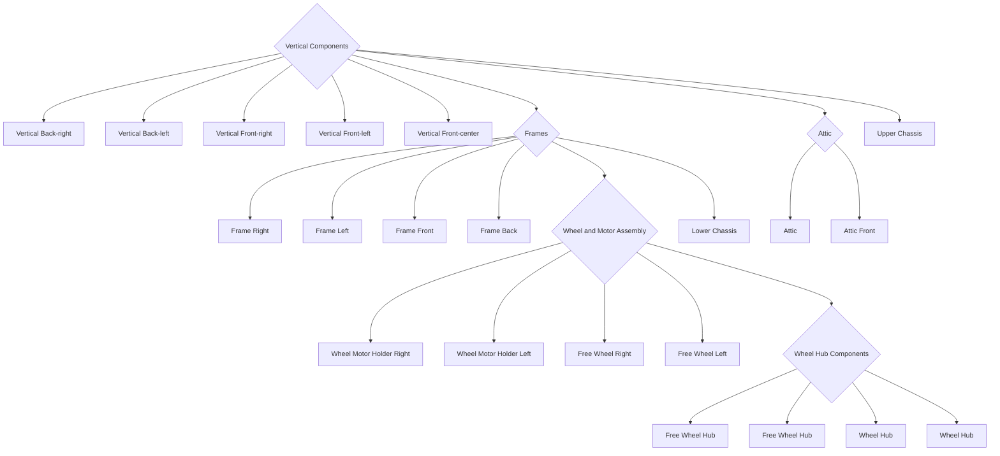

# Battlebot
This is a robot built for Tufts Robotics Club's fall Battlebots competition (it won!).

Its name's Jake.

## Building
Some under-specific directions for building this robot follow.

### The Model
Here is the model used to print it.

### Printing
Print all of the (about 20 parts).

### Hardware
No complete list of specific hardware here. But they must be ordered.

### Assembly
Here a rough diagram suggesting one general way to assemble the parts. Most required screws are the same type.

Make sure everything is wired up correctly. (Circuit diagram coming soon...)

### Code
All code is in [.ino](code). Upload this code the Arduino.

### Running
If the above extremely vague and incomplete instructions have somehow been followed, turn the transmitter on, turn safety switch off, and you're off!
