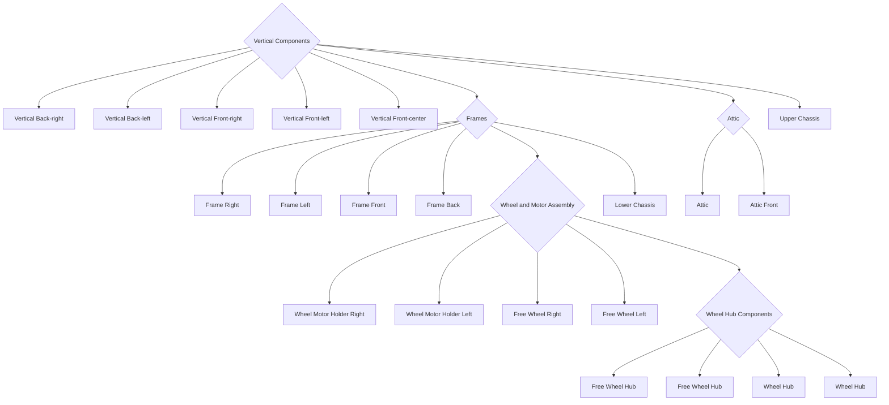

```mermaid
  


graph TD
    A{Frames};
    A1[Frame Right];
    A2[Frame Left];
    A3[Frame Front];
    A4[Frame Back];

    B{Vertical Components};
    B1[Vertical Back-right];
    B2[Vertical Back-left];
    B3[Vertical Front-right];
    B4[Vertical Front-left];
    B5[Vertical Front-center];

    C{Attic};
    C1[Attic];
    C2[Attic Front];

    D1[Upper Chassis];
    D2[Lower Chassis];

    E{Wheel and Motor Assembly};
    E1[Wheel Motor Holder Right];
    E2[Wheel Motor Holder Left];
    E3[Free Wheel Right];
    E4[Free Wheel Left];

    F{Wheel Hub Components};
    F1[Free Wheel Hub];
    F2[Free Wheel Hub];
    F3[Wheel Hub];
    F4[Wheel Hub];

    %% Frames
    A --> A1;
    A --> A2;
    A --> A3;
    A --> A4;

    %% Vertical Components
    B --> B1;
    B --> B2;
    B --> B3;
    B --> B4;
    B --> B5;

    %% Attic Assembly
    C --> C1;
    C --> C2;

    %% Wheel and Motor Assembly
    E --> E1;
    E --> E2;
    E --> E3;
    E --> E4;

    %% Wheel Hub Components
    F --> F1;
    F --> F2;
    F --> F3;
    F --> F4;

    B --> A;

    B --> C;

    B --> D1;


    A --> E;
    E --> F;
    A --> D2;

```

